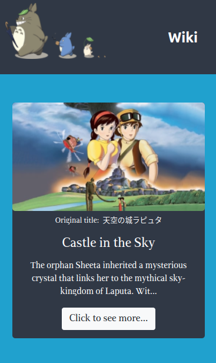
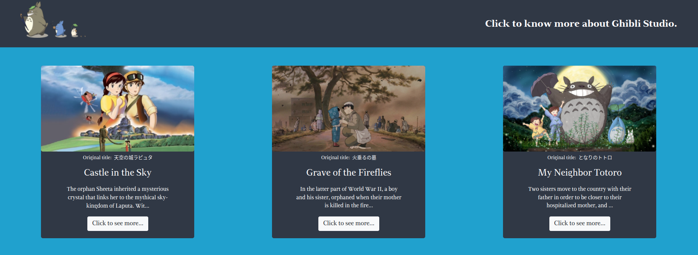
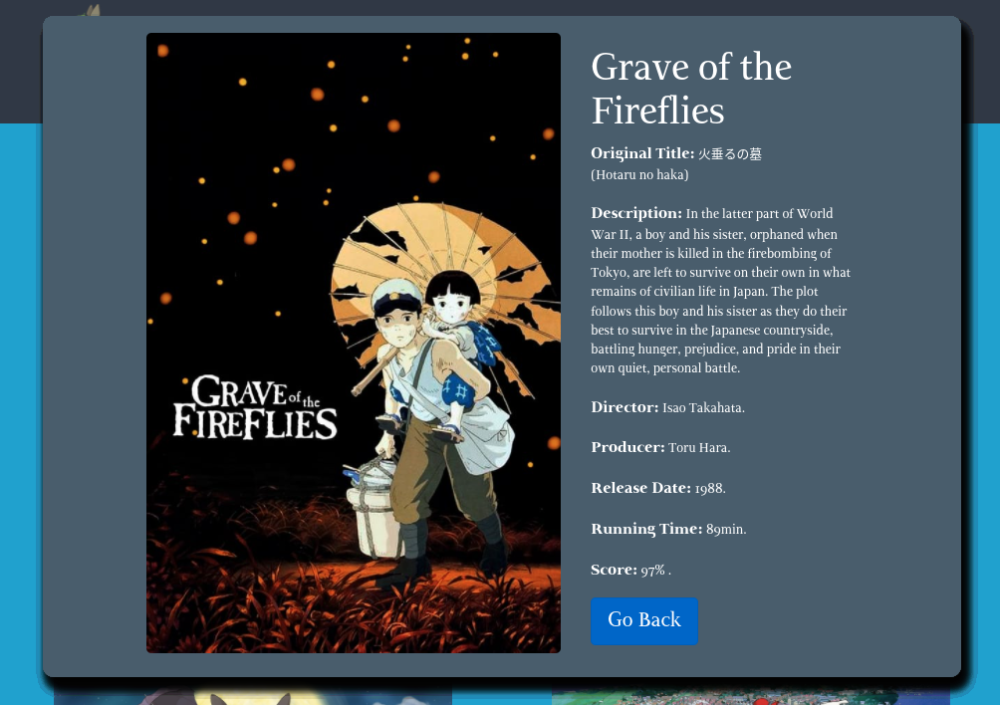

# Ghibli Catalog

> Ghibli





A online catalog of Studio Ghibli movies using API to fetch all information.

## Built With

- CSS
- Bootstrap
- JavaScript
- React

## Live Demo

[Live Demo Link](https://ghibli-catalog-6n6czbudz-tiagorahal.vercel.app/)


## Getting Started

To get a local copy up and running follow these steps.


### Prerequisites

- [npm](https://docs.npmjs.com/downloading-and-installing-node-js-and-npm)

### Setup

1. Download or clone the repository's contents.
2. Go to the project's root directory.
```
cd <project-folder>
```
3. Install all the dependencies:
```
npm install
```

### Install

You can either build a local production version of the project or open it directly on a server in development mode.

  #### Build

  1. To build and open a production version of the app run the command:
  ```
  npm run build
  ```
  2. Then open *dist/index.html* in you preferred browser.

  #### Start Development Server

  1. To open the app in development mode on *dev-server* run:
  ```
  npm start
  ```
  2. Then go to `http://localhost:8080/` in you preferred browser.

## Author

👨‍💻 **Tiago Rahal Aires**

- GitHub: [@tiagorahal](https://github.com/tiagorahal)
- Twitter: [@RahalAires](https://twitter.com/RahalAires)
- LinkedIn: [Tiago Rahal Aires](https://linkedin.com/tiagorahal)

## 🤝 Contributing

Contributions, issues, and feature requests are welcome!

Feel free to check the [issues page](https://github.com/tiagorahal/ghibli-catalog/issues).

## Show your support

Give a ⭐️ if you like this project!

## Acknowledgments

- Everyone at [Studio Ghibli API](https://ghibliapi.herokuapp.com/).
